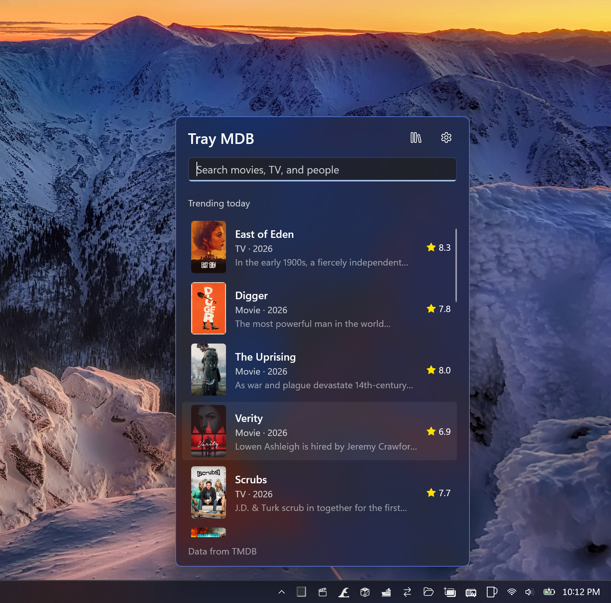

# Tray MDB

A movie and TV database that lives in the Windows notification area. Click the tray icon, search
TMDB, read the details, flag what you have seen or want to watch, press `Esc`. No window to manage,
no tab to find, nothing running while the flyout is closed.



---

## Contents

- [What it does](#what-it-does)
- [Install](#install)
- [Getting a TMDB key](#getting-a-tmdb-key)
- [Using it](#using-it)
- [Keyboard](#keyboard)
- [Build from source](#build-from-source)
- [How it is put together](#how-it-is-put-together)
- [Design rules](#design-rules)
- [Where your data lives](#where-your-data-lives)
- [Tests](#tests)
- [Releasing](#releasing)
- [Attribution and license](#attribution-and-license)

---

## What it does

- **Search everything.** One box over TMDB's multi-search: movies, shows, and people, debounced as
  you type, cancelled the moment the flyout hides.
- **Trending today.** With an empty search box the list shows today's trending movies and shows,
  refreshed every 30 minutes — but only while the flyout is actually on screen.
- **Detail pages.** Poster and backdrop, tagline, overview, rating and vote count, genres, cast and
  crew, and buttons to open the trailer, the where-to-watch page, IMDb, or the title on TMDB.
- **Follow the credits.** Click a cast member to open their page, click one of their "Known for"
  titles to open that, and walk back out with `Esc`, `Alt`+`Left`, or the mouse back button.
- **My stuff.** Flag any movie or show as *Seen* or *Want to watch* and the library button swaps the
  search box for a filter over the titles you flagged. Marking something seen clears its
  want-to-watch flag; clearing both flags drops it entirely.
- **Looks like the shell.** A borderless, rounded, light-dismissing popup anchored to the tray icon
  that slides and fades in, follows the taskbar's light/dark mode and accent tint, and never shows
  up in the taskbar or `Alt`+`Tab`.
- **Localized results.** Titles, overviews, age ratings, and where-to-watch providers follow your
  Windows display language and region.
- **Cheap at idle.** The window is destroyed a minute after it is dismissed, so an idle Tray MDB is
  a tray icon and a message loop.

## Install

Grab the `.msix` for your architecture (`x64` or `arm64`) from the
[Releases](https://github.com/Tray-Land/tray-mdb/releases) page and double-click it. Packages are
signed; Windows installs the Windows App Runtime dependency automatically if you do not have it.

After the first launch the flyout opens once to show you where the app lives. From then on, click
the tray icon.

Turn on **Settings → Start with Windows** to have the icon ready after you sign in.

## Getting a TMDB key

Tray MDB talks to the [TMDB API](https://developer.themoviedb.org/) and release builds ship with a
key. If you build it yourself you need your own:

1. Create a free TMDB account and open <https://www.themoviedb.org/settings/api>.
2. Copy either the **API Read Access Token** (a v4 JWT — preferred, sent as a bearer token) or the
   **API Key** (a v3 32-character key — sent as a query parameter). Tray MDB detects which one you
   pasted and uses it correctly.
3. Copy `OAuth.resw.sample` to `OAuth.resw` and paste the credential into the `TmdbApiKey` value.

```powershell
Copy-Item OAuth.resw.sample OAuth.resw
```

`OAuth.resw` is gitignored. The key is compiled into the app's resources and read through
`Services/Secrets.cs`; there is deliberately **no** key field in Settings. Without a key the flyout
shows a "no key" message instead of results.

## Using it

| Action | How |
| --- | --- |
| Open / close the flyout | Click the tray icon |
| Open it from anywhere | Launch Tray MDB again — the running instance opens its flyout |
| Settings | Gear button in the header, or the tray context menu |
| My stuff | The library button next to the gear |
| Quit | Tray context menu → **Exit** (the only way out; closing the flyout does not exit) |

## Keyboard

| Key | Does |
| --- | --- |
| `Enter` | Search; if results are already shown, open the first one |
| `Down` | Move from the search box into the result list |
| `Esc` | Back out of details or settings, then hide the flyout |
| `Alt`+`Left` | Back |
| `Alt`+`Home` | Back to search |
| `Alt`+`F4` | Hides the flyout (it does not quit the app) |
| Mouse back button | Back |

## Build from source

### Prerequisites

- Windows 10 version 1809 (17763) or later — `x64` or `ARM64`
- [.NET 10 SDK](https://dotnet.microsoft.com/download)
- **Developer Mode** enabled (Settings → System → For developers)
- A `OAuth.resw` with your TMDB credential (see [above](#getting-a-tmdb-key))

### Build and run

```powershell
# MSBuild wants x64/x86/ARM64, not AMD64
$arch = $env:PROCESSOR_ARCHITECTURE
$Platform = if ($arch -eq 'AMD64') { 'x64' } else { $arch }

dotnet build -c Debug -p:Platform=$Platform
dotnet run   -c Debug -p:Platform=$Platform
```

`dotnet run` goes through
[`Microsoft.Windows.SDK.BuildTools.WinApp`](https://www.nuget.org/packages/Microsoft.Windows.SDK.BuildTools.WinApp),
which registers a loose-layout package and launches the app with real package identity via its
AUMID — required for `ApplicationData`, the startup task, and the resource loader to work. Never
register the package by hand.

```powershell
# Start from a clean LocalState/LocalSettings to test first-run behavior
winapp run .\bin\$Platform\Debug\net10.0-windows10.0.26100.0 --clean

# Remove dev registrations when you are done
winapp unregister
```

Crashes are appended to `%TEMP%\TrayMDB-crash.log`.

## How it is put together

```
App.xaml.cs             Tray icon, single-instance mutex, context menu, the only exit path
Views/
  TrayFlyoutWindow      Borderless popup: positioning, slide/fade, light dismiss, shell theming
  FlyoutPage            Search, trending, details, person pages, back history, "My stuff"
  SettingsPage          A page inside the flyout, not a window
Controls/ShellBackdrop  The taskbar-flyout-style backdrop
Services/
  TmdbService           Which key, the shared HttpClient, language and region
  Secrets               App keys compiled in from OAuth.resw
  CredentialStore       Per-user tokens (Windows Credential Manager)
  LibraryService        Persists the seen / want-to-watch library to library.json
  SettingsService       Typed, fault-tolerant wrapper over ApplicationData.LocalSettings
  ForegroundPoller      Interval refresh that runs only while something is on screen
  ConnectivityService   Network-up notifications, so a poller can retry immediately
  SystemThemeService    Taskbar light/dark and accent state (drives the tray icon and backdrop)
  StartupService        The MSIX "start with Windows" task
  WindowPlacementService  Positions the popup against the tray icon on the right monitor
  MemoryService         Trims the working set once the app goes idle
Tmdb/                   Pure TMDB layer — no WinRT, so plain unit tests can reach it
  TmdbClient            The handful of v3 endpoints the app uses
  TmdbModels            Source-generated JSON models (trim-safe)
  TmdbFormat            Year, runtime, rating, provider, trailer, and image URL formatting
  Library               Seen / want-to-watch rules and persistence format
tests/TrayMDB.Tests     xUnit, net10.0, compiles Tmdb\*.cs straight in
```

### Lifetime

There is no main window. `App` owns the tray icon and a `Local\TrayMDB_SingleInstance` mutex; a
second launch signals a named event so the running instance opens its flyout, then exits. The
flyout window is created on demand, *hidden* on dismiss so reopening is instant, and closed for
real after a minute hidden — the next open builds a fresh window. `MemoryService.ReleaseIdle()`
runs whenever no window is left.

### Network discipline

All TMDB traffic goes through `ForegroundPoller` or a user action, and only while the flyout is
visible. The poller runs one refresh at a time, backs off exponentially on failure (capped at ten
minutes), retries immediately when the network comes back, and cancels in flight work on `Stop()`.
`FlyoutPage.OnHidden()` stops the poller and cancels pending searches and detail loads. Detail
pages are cached (20 entries) for the lifetime of the page.

## Design rules

If you are changing this app, these are the conventions it is built on:

1. **The flyout owns nothing it cannot stop.** Anything started in `FlyoutPage` must be stopped in
   `OnHidden` / `Dispose`.
2. **No background network work.** The only exception is work the tray icon itself displays, and it
   needs a documented reason.
3. **Secrets have a place.** App-wide API keys → `OAuth.resw` → `Services/Secrets`. Per-user tokens
   → `Services/CredentialStore`. Nothing secret goes anywhere near `SettingsService`.
4. **Decisions live in pure classes.** Parsing, policy, and formatting belong in `Tmdb/` with no
   WinRT dependency, so the `net10.0` test project can cover them.
5. **Settings are small.** `LocalSettings` values are capped at 8 KB; anything bigger (like the
   library) goes in a file under `LocalFolder`.
6. **Only Exit exits.** Closing, hiding, or `Alt`+`F4`-ing the flyout never ends the process.

More detail lives in [`AGENTS.md`](AGENTS.md) and [`.github/instructions/`](.github/instructions).

## Where your data lives

Everything is local to your machine; Tray MDB has no backend of its own and talks only to TMDB.

| Data | Where |
| --- | --- |
| Seen / want-to-watch library | `library.json` in the package's `LocalFolder` |
| First-run flag and preferences | Package `LocalSettings` |
| Start with Windows | The MSIX `StartupTask`, toggled in Windows' Startup apps |
| TMDB credential | Compiled into the package's resources from `OAuth.resw` |
| Crash log | `%TEMP%\TrayMDB-crash.log` |

Uninstalling removes all of it.

## Tests

The TMDB layer is pure .NET, so the tests are plain xUnit with no Windows App SDK in sight:

```powershell
dotnet test tests\TrayMDB.Tests
```

`TmdbClientTests` drives `TmdbClient` through a fake `HttpMessageHandler` (bearer vs. query-string
credentials, error mapping, filtering); `LibraryTests` covers the seen/want-to-watch rules and the
JSON round trip; `TmdbFormatTests` covers the formatting helpers. New decision logic belongs here.

## Releasing

`build-msix-for-gh.ps1` publishes signed `x64` and `arm64` MSIX packages and opens a **draft**
GitHub release:

```powershell
.\build-msix-for-gh.ps1                    # verify, build, sign, draft a release
.\build-msix-for-gh.ps1 -SkipRelease       # build and sign only
```

It refuses to run on a dirty or unpushed branch, or when the tag derived from the
`Package.appxmanifest` `<Identity Version="...">` already exists — bump the manifest version first.
Signing uses the maintainer's local `sign-msix` profile function, so no signing configuration is
checked in, and the publish profiles under `Properties/PublishProfiles` are gitignored.

## Attribution and license

Tray MDB uses the TMDB API but is **not** endorsed or certified by TMDB. Where-to-watch data is
provided by JustWatch. This attribution is required by the TMDB terms of use and is shown on the
Settings page — please leave it there.

Code is MIT licensed; see [LICENSE](LICENSE).
